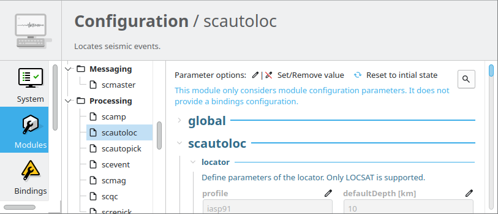
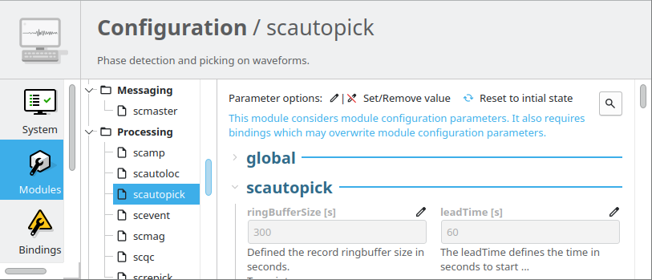
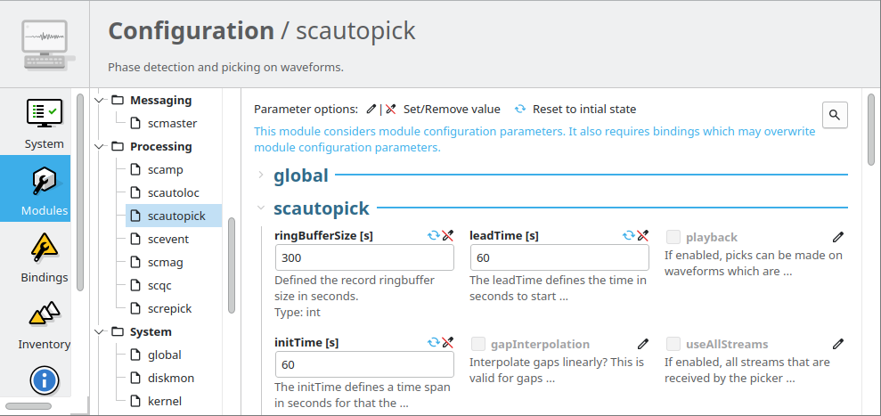
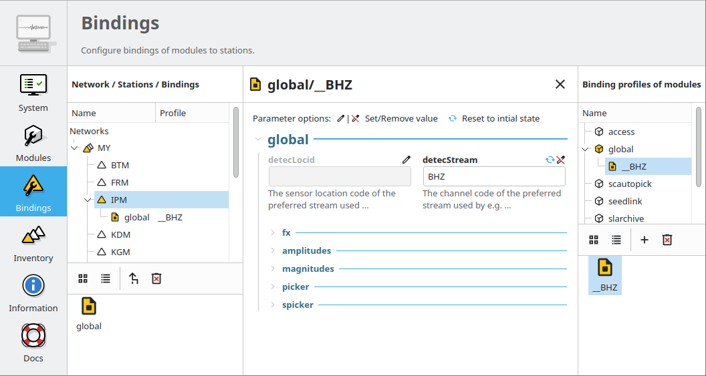
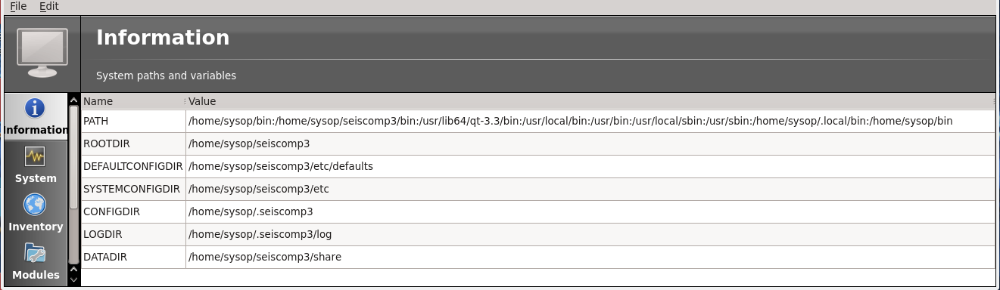

.. _concepts_configuration:

#############
Configuration
#############

Scope
=====

This chapter describes the configuration of a processing system and how all
the pieces gear into each other. It will cover module specific
configuration, inventory (station metadata) and module station bindings.

Overview
========

The |scname| framework defines a common schema to read configuration parameters.
This schema is used by all :ref:`SeisComP modules <concepts_modules>` with names
starting with **sc**, e.g. `scautopick`. Other modules might be available
as well such as third party modules which use other naming conventions.

A way to discover a module that uses the |scname| configuration schema
is to call it with ``--help``. The first lines of a typical output look like
this:

.. code-block:: sh

   Generic:
     -h [ --help ]                         Produce help message
     -V [ --version ]                      Show version information
     --config-file arg                     Use alternative configuration file

The reason for that is that there are also other modules which do not
use the |scname| core and client libraries such Seedlink plugins, Seedlink
itself and some others which are not part of the trunk source package. Those
modules need translators to generate their native configuration when
the configuration is updated (``seiscomp update-config``).

Again, the two indicators that a module uses the following configuration
schema are:

* The module name is prefixed with **sc**, e.g. *scautopick*
* The output of ``--help`` looks like the text fragment above

A typical configuration requires the following steps:

#. Generation and import of an inventory (station meta data): Read the concept
   section :ref:`concepts_inventory`,
#. :ref:`Configuration of modules <global_modules_config>`,
#. :ref:`Configuration of bindings <global_bindings_config>`.

.. note::

   :ref:`Standalone modules <concepts_modules>` can also run without inventory.

.. _concepts_configuration-configs:

Configuration of Modules
========================

|scname| modules provide 2 types of configurations:

* :ref:`Module configurations <global_modules_config>` define module control
  parameters which are equally applied to all operations on waveforms, event
  parameters, graphical user interfaces, etc.

  **All** :ref:`daemon modules <concepts_modules_daemon>` and **some**
  :ref:`command-line tools <concepts_modules_commandline>` provide module
  configurations. *Module configurations are overridden by bindings
  configurations.*

* :ref:`Binding configurations <global_bindings_config>` define control
  parameters per station and even stream. They are used for station- and even
  stream-specific definitions, e.g. the data acquisition from a particular
  station or server using :ref:`seedlink` or the phase detection by
  :ref:`scautopick`.

  In contrast to module configuration, **only some**
  :ref:`daemon modules <concepts_modules>` and a very few
  :term:`GUI modules <GUI>` provide bindings. *Binding configurations override
  module configurations.*

Whether or not a module considers bindings configurations can be read in the
module configuration panel of :ref:`scconfig`.

.. raw:: html

   

   scconfig modules panel indicating that no bindings can be configured.

   scconfig modules panel indicating that bindings can be configured.

.. raw:: html

   

.. _global_modules_config:

Module configuration
--------------------

Configurations for modules are saved as :file:`*.cfg` files. There are three
directories involved where configuration files can be stored:

#. :file:`$SEISCOMP_ROOT/etc/defaults/`: This directory ships with the distribution
   of |scname| and should never be touched. All contained files might be
   overwritten with the next software update.
#. :file:`$SEISCOMP_ROOT/etc/`: This directory will never be populated by a software
   update and it is save to store global module configuration files there.
   Depending on the system setup this directory might be read-only to users.
   It is called the system configuration directory.
#. :file:`$HOME/.seiscomp/`: This directory is in the user's home directory and
   it is meant to provide configurations which override default and system
   configurations.
   It is called the user configuration directory.

Furthermore there are two file names involved in each directory:
:file:`global.cfg` and :file:`[module].cfg`. The file :file:`global.cfg`
will be loaded by all modules and it is a good place to store common
parameters such as messaging connections or logging configurations.

The three directories and two files result in 6 locations to read all of a
module's configuration parameters:

#. :file:`$SEISCOMP_ROOT/etc/defaults/global.cfg`
#. :file:`$SEISCOMP_ROOT/etc/defaults/[module].cfg`
#. :file:`$SEISCOMP_ROOT/etc/global.cfg`
#. :file:`$SEISCOMP_ROOT/etc/[module].cfg`
#. :file:`$HOME/.seiscomp/global.cfg`
#. :file:`$HOME/.seiscomp/[module].cfg`

The order of the configuration files above also represents the order of loading.
Parameters can be available in any of these files. The last occurrence of a
parameter takes priority such as  configurations in :file:`$HOME/.seiscomp/`.

Adjusting
~~~~~~~~~

:ref:`scconfig` provides a user-friendly graphical interface to adjust the
global and the module configuration parameters.

   scconfig modules module configuration panel.

Alternatively, you may adjust the module configuration files corresponding to
a module. An easy way of getting started is to copy the default configuration
file in :file:`$SEISCOMP_ROOT/etc/defaults/` to :file:`$SEISCOMP_ROOT/etc/` and
adjust it there.

.. warning::

   Do not adjust any parameter in the default configuration files located in
   :file:`$SEISCOMP_ROOT/etc/defaults/` as they will be overwritten by future
   software updates.

Application
~~~~~~~~~~~

Module configurations are usually read when starting a module and cannot be
changed during runtime. For applying any change on module configuration

#. Save the configuration,
#. Restart or execute all affected modules.

In addition to a permanent configuration you may temporally override any
configuration parameter when executing a module. Provide the full structure of
the configuration parameter on the command line along with "=" between parameter
and value. This will identify the parameter as a configuration parameter
overridden on the command line. E.g. refer to the codes parameter of
:ref:`scrttv` in the streams section as `codes.streams`:

.. code-block:: sh

   $ scrttv --streams.codes="GR.*.*.HH?"

.. _global_bindings_config:

Bindings configuration
----------------------

Bindings configure parameters specific to stations and for a certain module.
A station might require a custom set of parameters for e.g. data acquisition from
a remote data logger or server, for processing or
displaying. |scname| design is that bindings will be stored
in the database. All modules requiring this information read them from the
database. In this way consistent inventory and its bindings will be distributed
to all modules running locally or on remote computers.

.. hint::

   Bindings can be conveniently configured in the Bindings panel of :ref:`scconfig`.
   Read the section :ref:`scconfig-bindings` for instructions.

.. _config-fig-binding:

.. figure:: ../media/binding.*
   :align: center

   Binding

   A binding holds the configuration how a station is used in a module.

Parameters defined in bindings override parameters in module configurations.
Bindings configurations are saved as stations bindings or as bindings profiles with
given names:

#. **Station binding parameters:** :file:`$SEISCOMP_ROOT/etc/key/[module]/station_NET_STA`
   is used only be one station NET.STA.
#. **Binding profile parameters:** :file:`$SEISCOMP_ROOT/etc/key/[module]/profile_[name]`
   can be used by many stations. Then any update of this file applies to all stations
   bound to this profile.

Like in this list, the actual binding parameters for each module are
expected in either :file:`etc/key/$MODULE/station_$NET_$STA` or
:file:`etc/key/$MODULE/profile_$PROFILE`. That depends if a profile should
be used or not. If the station key file registers a module with a colon
following a name then this name is the profile name. If just a module is given
then the station binding file will be read.

The bindings themselves are links from the module to the station. They are written
into key files, e.g.

* :file:`$SEISCOMP_ROOT/etc/key/station_NET_STA`

Example of bindings profiles:

.. code-block:: properties

   # Binding references
   global:__HH
   scautopick:default
   seedlink:geofon

Example of bindings profiles and a station binding for slarchive:

.. code-block:: properties

   # Binding references
   global:__HH
   scautopick:default
   seedlink:geofon
   slarchive

The key files are named like :file:`station_$NET_$STA`, e.g. :file:`station_GE_MORC`.
The names within the key files define for which modules the station registers. In the
above example it is the **global**, **scautopick**, **seedlink** and slarchive.

To list all modules a particular station is configured for is very simple by printing the content
of the station key file:

.. code-block:: sh

   $ cat etc/key/station_GE_MORC
   seedlink:geofon
   global:BH
   scautopick

Another way is a bit more complicated but at least all information is
there. To show all stations configured for SeedLink could be done this way:

.. code-block:: sh

   $ for i in `find etc/key -type f -maxdepth 1 -name "station_*_*"`; do
   > egrep -q '^seedlink(:.*){0,1}$' $i && echo $i;
   > done
   etc/key/station_GE_MORC
   etc/key/station_GE_UGM

Modules usually read the bindings configuration from the database but not from files.
Therefore,  the bindings are stored in the database when executing

.. code-block:: sh

   $ seiscomp update-config

The database tables involved are ``ConfigModule``, ``ConfigStation``, ``Setup``,
``ParameterSet`` and ``Parameter``.

.. _config-fig-configdb-schema:

.. figure:: ../media/configdb-schema.png
   :align: center

   Configuration database schema

To illustrate the contents of the objects, the XML representation
is used below.

.. code-block:: xml

   <Config>
     <module publicID="Config/trunk" name="trunk" enabled="true">
       ...
     </module>
   </Config>

A ConfigModule with publicID *Config/trunk* is created with name *trunk*. This
ConfigModule is managed by the global initialization script (:file:`etc/init/trunk.py`)
and will be synchronized with configured bindings of all trunk modules. The
ConfigModule trunk is the one that is actually used by all configurations unless
configured otherwise with:

.. code-block:: sh

   $ scapp --config-module test

Here :program:`scapp` would read ConfigModule *test*. Because a ConfigModule *test*
is not managed by :program:`seiscomp update-config` it is up to the user to create
it.

For each station that has at least one binding, a ConfigStation object is
attached to the ConfigModule:

.. code-block:: xml

   <Config>
     <module publicID="Config/trunk" name="trunk" enabled="true">
       <station publicID="Config/trunk/GE/UGM"
                networkCode="GE" stationCode="UGM" enabled="true">
         ...
       </station>
     </module>
   </Config>

and finally one Setup per module:

.. code-block:: xml

   <Config>
     <module publicID="Config/trunk" name="trunk" enabled="true">
       <station publicID="Config/trunk/GE/UGM"
                networkCode="GE" stationCode="UGM" enabled="true">
         <setup name="default" enabled="true">
           <parameterSetID>
             ParameterSet/trunk/Station/GE/UGM/default
           </parameterSetID>
         </setup>
         <setup name="scautopick" enabled="true">
           <parameterSetID>
             ParameterSet/trunk/Station/GE/UGM/scautopick
           </parameterSetID>
         </setup>
       </station>
     </module>
   </Config>

Here two setups have been created: *default* (which is a special case for
module *global* to be backwards compatible) and *scautopick* where each
refers to a ParameterSet by its publicID. The next XML fragment shows
the ParameterSet referred by the scautopick setup of station GE.UGM:

.. code-block:: xml

   <Config>
     <parameterSet publicID="ParameterSet/trunk/Station/GE/UGM/scautopick"
                   created="...">
       <baseID>ParameterSet/trunk/Station/GE/UGM/default</baseID>
       <moduleID>Config/trunk</moduleID>
       <parameter publicID="...">
         <name>timeCorr</name>
         <value>-0.8</value>
       </parameter>
       <parameter publicID="...">
         <name>detecFilter</name>
         <value>
           RMHP(10)&gt;&gt;ITAPER(30)&gt;&gt;BW(4,0.7,2)&gt;&gt;STALTA(2,80)
         </value>
       </parameter>
       <parameter publicID="...">
         <name>trigOff</name>
         <value>1.5</value>
       </parameter>
       <parameter publicID="...">
         <name>trigOn</name>
         <value>3</value>
       </parameter>
     </parameterSet>
   </Config>

The mapping to the binding configuration files is 1:1. Each parameter in
the configuration file is exactly one parameter in the database and their
names are matching exactly.

The concept of global bindings which are specialized for each module is
reflected by the *baseID* of the ParameterSet which points to setup *default*
of station GE.UGM:

.. code-block:: xml

   <Config>
     <parameterSet publicID="ParameterSet/trunk/Station/GE/UGM/default"
                   created="...">
       <moduleID>Config/trunk</moduleID>
       <parameter publicID="...">
         <name>detecStream</name>
         <value>BH</value>
       </parameter>
     </parameterSet>
   </Config>

This ends up with a final configuration for scautopick and station GE.UGM:

===========   ==================
Name          Value
===========   ==================
detecStream   BH
timeCorr      -0.8
detecFilter   RMHP(10)>>ITAPER(30)>>BW(4,0.7,2)>>STALTA(2,80)
trigOff       1.5
trigOn        3
===========   ==================

which is the concatenation of the two files :file:`etc/key/global/station_GE_UGM`
and :file:`etc/key/scautopick/station_GE_UGM`. The filter grammar is explained in
:ref:`filter grammar section <filter-grammar>`.

The :file:`etc/key` directory is only used to ease the configuration of bindings.
They are finally transferred to the database or converted to other
representations a module might require to access them. The  directory :file:`etc/key` is meant
for backup and used for copying bindings from one computer to another.

:ref:`scconfig` provides a graphical interface to adjust the global and the module
bindings parameters and to create the bindings. It populates the :file:`etc/key`
directory and it takes care that they synchronize with the database when processing
*Update configuration* in the *System* panel.

   scconfig modules bindings configuration panel.

Example: global bindings
~~~~~~~~~~~~~~~~~~~~~~~~

A binding is a set of name value pairs just like a configuration file but for
a station. In the file system a binding looks like this:

.. code-block:: properties

   detecLocid = ""
   detecStream = HH

Simple. These are actually two parameters from the global binding and it solves
a common issue elegantly: a station might provide a couple of channels, often
data in various sampling rates, e.g. LH, BH, SH and HH. Co-located stations
with velocity and acceleration sensors also provide at least two channel groups,
e.g. HL and HH. Those groups are also provided with different location code,
e.g. 00 and 10. To process a station a module needs to know which channel
it should process. To display a representative data channel a viewer needs to
know which channel to show. Global bindings solve that issue by defining the
"preferred" location code and channel code with the two parameters `detecLocid`
and `detecStream`. The TraceView, :ref:`scrttv` can read all available station
bindings, compose a fully qualified channel name from network code (part of the
binding), station code, detecLocid and detecStream. It will then lookup the
inventory information for that channel and display it.

The meta data of a binding are:

* Network code,
* Station code,
* Module name.

The actual binding data are the key value pairs.

Reading bindings
~~~~~~~~~~~~~~~~

Binding configuration parameters are read during a module start after the module
configuration parameters.
They override the module configuration.
Like module configurations, parameters defined in the global bindings can be
overridden in module bindings. The order of loading is:

#. :file:`$SEISCOMP_ROOT/etc/key/global/`: Global bindings configurations
#. :file:`$SEISCOMP_ROOT/etc/key/[module]`:  Bindings configurations for a particular module.

If the module connects to a messaging server then it will receive the database parameters,
connect to it and read the bindings. Otherwise the user has to provide the
database address. A module never reads the key directory. It only
gets the bindings from the configuration tables.

As with inventory information there might are cases when a module should
not connect to a database and work offline, in particular when ``--ep`` is being
used.

In order to
read the bindings configuration from XML files (again in SCML format),
use :ref:`scxmldump` to dump the configuration XML file and let
the module use this XML file, ``--config-db`` must be used:

.. code-block:: sh

   $ myapp --config-db config.xml

That will completely bypass the database (even if used for event information or
inventory) for reading station bindings.

To extract a configuration XML file from the database, :ref:`scxmldump` can be used:

.. code-block:: sh

   $ scxmldump -fC -d localhost -o config.xml

One can also create a config XML file straight from the ``etc/key`` directory
with ``bindings2cfg``:

.. code-block:: sh

   $ bindings2cfg -o config.xml

To create an XML file from a temporary key directory, an alternative directory
can be specified with ``--key-dir``:

.. code-block:: sh

   $ bindings2cfg --key-dir /tmp/key -o config.xml

Application
~~~~~~~~~~~

Binding configurations are read when starting a module and cannot be
changed during runtime. For applying any change on binding configurations

#. Save the configuration,
#. Update the configuration

   .. code-block:: sh

      $ seiscomp update-config

#. Restart or execute all affected modules.

Summary
~~~~~~~

* Bindings are maintained as key files in :file:`etc/key`,
* Key files are another human readable representation of bindings,
* ``seiscomp update-config`` or ``seiscomp update-config trunk`` writes the
  information from :file:`etc/key` to the database,
* A module never reads :file:`etc/key`,
* Bindings are being read from the database or an XML file.

.. _concepts_configuration_parameters:

Format of Parameters
====================

The :term:`trunk` configuration files are simple text files where each line
is a name-value pair containing the parameter name and its value.

Parameter values can be provided as

* plain values or comma-separated lists on single or multiple lines
  (read sections below) or as
* :ref:`variables <concepts_configuration_variables>`, allowing to refer to
  previously defined parameters, e.g., in :file:`global.cfg` or to define relative
  directories related to the |scname| installation or the Linux system.

.. warning::

   In contrast to previous versions of |scname| the parameter names are now
   case-sensitive. Use :ref`scchkcfg` to check configurations from previous
   versions regarding case-sensitivity.

Basic
-----

Module and binding configuration files are simple text file where each line is a
name-value pair for one parameter. The parameter names are case-sensitive. The
format is a simple as:

.. code-block:: properties

   agencyID = gempa
   recordstream = slink://localhost:18000

In parameter groups indicated by a separating dot (".") the dot separates the group
from the parameter name.

Later assignments of parameters override previous ones so the order of lines in the
configuration file is important. The file is parsed top-down.

.. note::

   Values are not type-checked. Type checking is part of the module
   logic and will be handled there. The configuration file parser will not raise
   an error if a string is assigned to a parameter that is expected to be an
   integer.

Comments
--------

Everything following an unescaped **#** (hash) is a comment and is going to
be ignored. Blank lines and white spaces are ignored by the parser as well
unless quoted or escaped. Escaping is done by prepending a backslash (**\\\\**)
to the character that needs escaping. It backslash should be part of the
string, two backslashes should be used (**\\\\\\\\**).

.. code-block:: properties

   agencyID = gempa  # This is a comment

   # The preceding empty line is ignored. Now the value of skyColor is replaced
   # with 'blue'.
   # The final value of a parameter is the result of the last assignment parsed
   # from top to bottom.
   agencyID = gempa

Lists
-----

Values can be either scalar values or lists. List items are separated by commas.

.. code-block:: python

   # This is a list definition
   rainbowColors = red, orange, yellow, green, blue, indigo, violet

If a value needs to include a comma, white space or any other special
character it can either be escaped with backslash ('\\') or quoted with double
quotes ("). Whitespaces are removed in unquoted and unescaped values.

.. code-block:: properties

   # This is a comment

   # The following list definitions have 2 items: 1,2 and 3,4
   # quoted values
   tuples = "1,2", "3,4"
   # escaped values
   tuples = 1\,2, 3\,4

The value of the parameter tuples is now `["1,2", "3,4"]`.

Multi-line
----------

Values can extend over multiple lines if a backslash is appended to each line

.. code-block:: properties

   # Multi-line string
   text = "Hello world. "\
          "This text spawns 3 lines in the configuration file "\
          "but only one line in the final value."

   # Multiline list definition
   rainbowColors = red,\
                   orange,\
                   yellow,\
                   green, blue,\
                   indigo, violet

Namespaces
----------

A basic usage of variable names is to organize them in namespaces. A common
habit is to separate namespaces and variable names with a period character:

.. code-block:: properties

   colors.sky = blue
   colors.grass = green

Here a namespace called ``colors`` is used. The configuration file parser does
not care about namespaces at all. The final name (including the periods) is what
counts. But to avoid repeating namespaces again and again, declarations can
be wrapped in a namespace block. See the following example:

.. code-block:: properties

   colors {
      sky = blue
      grass = green
   }

Application code will still access ``colors.sky`` and ``colors.grass``.
Namespaces can be arbitrarily nested and even survive includes.

.. code-block:: properties

   A {
      B1 {
         var1 = 123
      }

      B2 {
         var1 = 456
      }
   }

The final list of parameter names is:

* A.B1.var1
* A.B2.var1

.. _concepts_configuration_variables:

Variables
=========

Environment or preceding configuration variables (configuration parameters) can
be used as values for :ref:`parameters <concepts_configuration_parameters>` in
the configuration of SeisComP modules with `${var}`, e.g.

.. code-block:: properties

   plugins = ${plugins}, hypo71

   homeDir = ${HOME}
   myPath = ${homeDir}/test
   myseiscomp = ${SEISCOMP_ROOT}

|scname| knows internal variables defining the it environment. The can be used
with `@var@`, e.g.

.. code-block:: properties

   autoloc.stationConfig = @DATAGDIR@/autoloc/station.conf

Available internal |scname| variables are:

+------------------+-----------------------------+
| Variable         | Value                       |
+==================+=============================+
| ROOTDIR          | $SEISCOMP_ROOT              |
+------------------+-----------------------------+
| DEFAUTLCONFIGDIR | $SEISCOMP_ROOT/etc/defaults |
+------------------+-----------------------------+
| SYSTEMCONFIGDIR  | $SEISCOMP_ROOT/etc          |
+------------------+-----------------------------+
| DATADIR          | $SEISCOMP_ROOT/share        |
+------------------+-----------------------------+
| CONFIGDIR        | $HOME/.seiscomp             |
+------------------+-----------------------------+
| LOGDIR           | $HOME/.seiscomp/log         |
+------------------+-----------------------------+

The list of internal |scname| variables can also be read in the information
panel of :ref:`scconfig`.

   scconfig information panel indicating the internal |scname| variables.

The internal |scname| variable CONFIGDIR can be re-defined by the SHELL
environment variable SEISCOMP_LOCAL_CONFIG. Setting SEISCOMP_LOCAL_CONFIG will
also effect LOGDIR which is automatically set to
:file:`$SEISCOMP_LOCAL_CONFIG/log`.
Example:

.. code-block:: sh

   export SEISCOMP_LOCAL_CONFIG=/var/log/seiscomp

Related Tools
=============

* :ref:`bindings2cfg`
* :ref:`scchkcfg`
* :ref:`scconfig`
* :ref:`scdumpcfg`
* :ref:`scxmldump`
