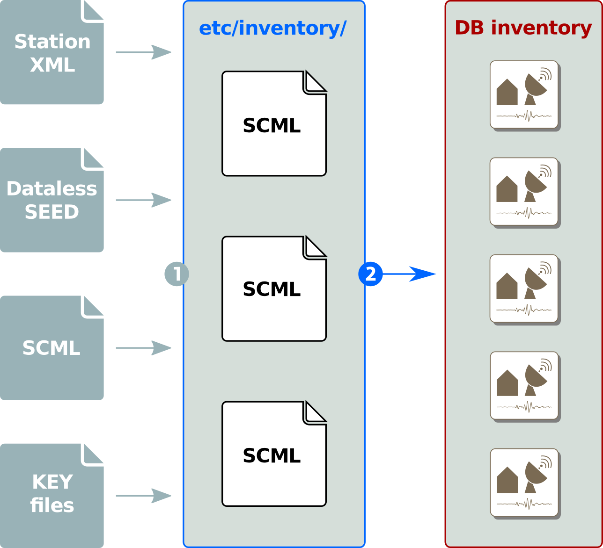

.. _concepts_inventory:

*********
Inventory
*********

Scope
=====

This chapter describes the concept of inventories.

Overview
========

In |scname| the term :term:`inventory` refers to the meta data of data recording
stations.
Many |scname| :ref:`modules <concepts_modules>` require inventory information to
operate correctly and a correct inventory is therefore fundamental to |scname|.

The inventory will be read from the :ref:`database <concepts_database>`
by default. To insert or update the inventory in the database, this information
needs to be created or downloaded and converted. The following sections will
describe the process of populating the database and how applications get access
to it.

The format used for inventory is known as :term:`SCML`. Correct inventory in
:term:`SCML` format can be generated by :cite:t:`smp`. Some modules for
**converting from other formats** are listed in section
:ref:`concepts_inventory_format`. Tools for **processing inventory** are
listed in section :ref:`concepts_inventory_tools`.

The inventory shall contain all meta data describing the full recording system
and the
pre-processing of the raw data stream provided to the data processing modules
using the :ref:`RecordStream <concepts_recordstream>`. Inventories should be
always complete w.r.t the
processed data streams, correct and up-to-date. Beside network, station, location
and stream information they must include the full sensor and datalogger responses.

Older version used key files to configure available networks and stations.
Because the support of response meta-data was very limited, tools were build to
add this functionality. Since the release of Seattle the concept of key files
for station meta-data has been completely removed from the system. Now |scname|
only handles station meta-data in its own XML format called :term:`SCML`.
The task of supporting old key files, dataless SEED and other formats has been
out-sourced to external applications. The inventory synchronization is a
:ref:`two-stage process <config-fig-inventory-sync>`:

#. Convert :ref:`external formats <concepts_inventory_format>` into :term:`SCML`
#. Synchronize inventory pool with the database: merged all inventory files and
   synchronize with the database using :program:`scinv snyc`.

.. _config-fig-inventory-sync:

   Inventory synchronization as a two-stage process

All station meta-data are stored in :file:`etc/inventory`
and can be organized as needed. Either one file per network, a file containing the
complete inventory or one file for all instruments and one file per station.
The update script

.. code-block:: xml

   $ scinv sync

loads the existing inventory from the database and merges each file in :file:`etc/inventory`.
Finally it removes all unreferenced objects and sends all updates to the database.

The |scname| :ref:`configuration <concepts_modules>` does not deal with station
meta-data anymore.
It only configures parameters for modules and module-station associations.
The management of the inventory can and should be handled by external tools
e.g. :cite:t:`smp`.

The |scname| documentation describes the
:ref:`data model including the inventory <api-datamodel-python>`.

.. _concepts_inventory_format:

Inventory Format
================

A typical inventory file in :term:`SCML` looks like this:

.. code-block:: xml

   <?xml version="1.0" encoding="UTF-8"?>
   <seiscomp xmlns="http://geofon.gfz-potsdam.de/ns/seiscomp-schema/0.11" version="0.11">
     <Inventory>
       <sensor>...
       <datalogger>...
       <network>...
     </Inventory>
   </seiscomp>

The version attribute of the ``seiscomp`` tag represents the schema version of
the |scname| data model which is consistent with the database schema version
and the version of all other representations.

.. note::

   All geographic coordinates (latitudes, longitudes, elevation) are assumed in the
   World Geodetic System 1984 (WGS84) reference system (National Imagery and
   Mapping Agency 2000). Latitudes, longitudes are provided in degrees but
   elevations are given in meters.

Inventories must be provided to |scname| in XML files in :term:`SCML` format. A
convenient way to generate clean and correct inventory files in :term:`SCML`
format is :cite:t:`smp`. Tools are provided to convert between other formats:

.. csv-table::
   :widths: 1 1
   :header: Module namespace, Conversion
   :align: left

   arclink2inv, Arclink XML to SeisComPML
   :ref:`dlsv2inv`, dataless SEED to SeisComPML
   :ref:`inv2dlsv`, SeisComPML to dataless SEED
   :ref:`fdsnxml2inv`, FDSN StationXML to SeisComPML and back

Adding / Updating Inventory
===========================

To add inventory information to the |scname| database one either has to write directly
to the database with custom script (not recommended) or place :term:`SCML` files
in :file:`@SYSTEMCONFIGDIR@/inventory`. The service to import all data in that
directory can be called with

.. code-block:: sh

   $ seiscomp update-config inventory

This command runs :ref:`scinv` finally. :ref:`scinv` merges all XML files and
synchronizes the merged local inventory tree with the database. That is a
rather complex process and for more information it is recommended to study
the source code of :ref:`scinv`. The bottom line is that inventory data is created
from :term:`SCML` files.

Because nobody will ever create such XML files by hand, tools are necessary.
A quite popular tools is the online station management portal (SMP)
:cite:p:`smp`. SMP will output XML in version of :term:`SCML` directly.

Another source is the FDSN station webservice (FDSNWS). If the |scname|
implementation of FDSNWS is used, the SeisComP XML format can be requested
directly as an extension. Otherwise FDSN StationXML will be provided. Inventory
in FDSN StationXML needs to be converted with either :ref:`fdsnxml2inv` or
:ref:`import_inv`. The latter is a more versatile application that also supports
several import formats.

.. code-block:: sh

   $ import_inv fdsnxml download-1234.xml

This will automatically place the output XML file in
:file:`@SYSTEMCONFIGDIR@/inventory`. Afterwards call

.. code-block:: sh

   $ seiscomp update-config inventory

to synchronize the changes with the database. If :program:`scconfig` is used,
then either the ``Sync`` button of the `Inventory` panel or the
``Update configuration`` button of the ``System`` panel must pressed.

**Summary**

In order to populate the database with inventory information, the following
steps have to be performed:

#. Convert existing station meta data formats to :term:`SCML`
#. Place all :term:`SCML` files at :file:`@SYSTEMCONFIGDIR@/inventory`
#. Synchronize the inventory files and write the meta data to the database. Run

   .. code-block:: sh

      $ scinv sync

   or

   .. code-block:: sh

      $ seiscomp update-config inventory

Reading Inventory
=================

Applications usually connect to the database and read the necessary inventory
information. An application can decide whether it requires full response
information including sensor and data logger response functions or just channel
information without instrument descriptions. The latter performs faster and
some applications do not require full instrument information.

An application usually does not require special configuration to read inventory
information. A database connection is enough and it comes usually along with the
handshake message of the messaging server.

If the messaging is not involved, the database can be specified by the
command-line option ``-d``:

.. code-block:: sh

   $ myapp -d [type]://[user]:[password]@[host]:[port]

There are cases when an application should be run without a database connection
but requires inventory information, particularly in combination with the
``--ep`` command line argument. To direct an application to an inventory XML file
(again in :term:`SCML` format), ``--inventory-db`` must be used:

.. code-block:: sh

   $ myapp --inventory-db inventory.xml

The option ``--inventory-db`` will cause the module to completely bypass
the database for reading inventory information even if used for event
information. The file :file:`inventory.xml` can be created from the database
using :ref:`scxmldump`.

.. _concepts_inventory_tools:

Related Tools
=============

* arclink2inv
* :ref:`dlsv2inv`
* :ref:`fdsnxml2inv`
* :ref:`import_inv`
* :ref:`invextr`
* :ref:`inv2dlsv`
* :ref:`sccnv`
* :ref:`scinv`
* :ref:`scxmldump`
* :ref:`tab2inv`
* :ref:`tabinvmodifier`
