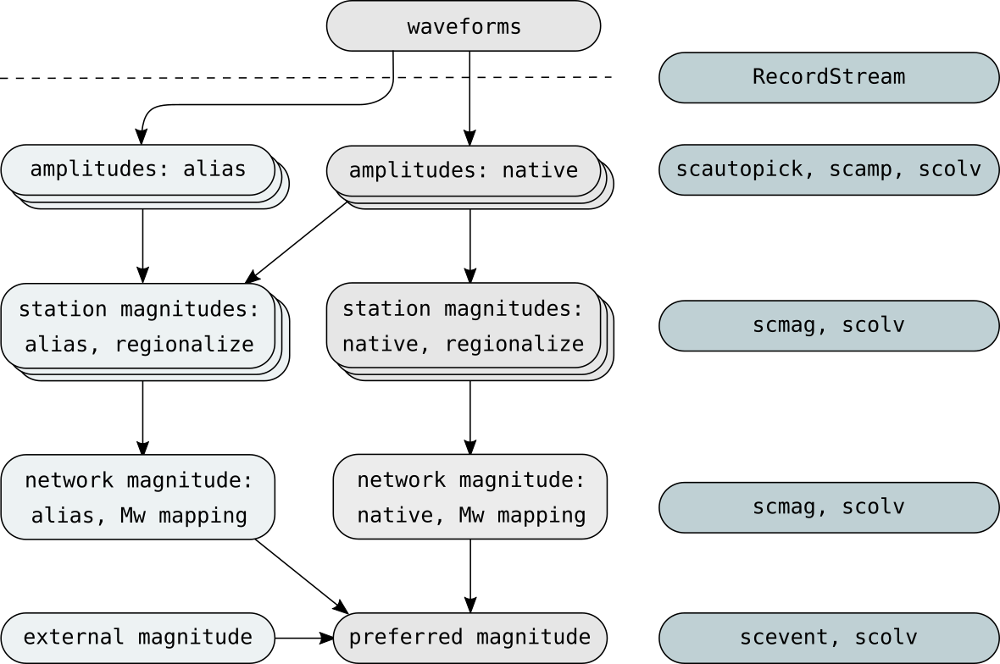

.. _concepts_magnitudes:

Amplitudes and Magnitudes
#########################

:ref:`Magnitudes of specific types <concepts_magnitudes-station>` are computed
from :ref:`amplitudes <concepts_magnitudes-amplitudes>` measured on waveforms.
Different types of amplitudes and magnitudes are available including aliases.
All magnitudes can be regionalized and mapped to Mw. The native amplitude and
magnitudes types are listed in :ref:`scamp` and :ref:`scmag`.

All amplitude and magnitude values can be read in the Magnitudes tab of
:ref:`scolv`, in bulletins created by :ref:`scbulletin` and dumped
from database to XML for an origin or event by :ref:`scxmldump`.

This concept section describes the principles applied in |scname| and links to
more specific sections including tutorials describing the configuration and
application.

   Schematic processing flow for computing magnitudes from measured amplitudes
   including the involved |scname| modules and interfaces. Multiple network
   magnitude types can be computed for the same :term:`origin`. The default
   processing of native amplitudes and magnitudes in the center can be extended
   by aliases, regionalization, Mw mapping or external magnitudes.

.. _concepts_magnitudes-amplitudes:

Amplitudes
==========

Amplitudes can be measured on waveforms

* Automatically during phase picking by :ref:`scautopick` with generally fixed
  time windows due to the absence of knowledge about source parameters.
* Automatically by :ref:`scamp` as soon as :term:`origins <origin>` are
  available. Depending on the amplitude type and their configuration, fixed or
  distance-dependent time windows as well as constraints on signal quality apply.
* Interactively using :ref:`scolv` with preset or user-defined conditions.

:ref:`Time grammar <time-grammar>` applies for configuring the time windows.

Input data
----------

Depending on type amplitudes are measured on raw or filtered waveform data.
Initial raw data are given in counts of the digitizer with a stream gain unit of
m/s which is typical for seismometers.
It is assumed that the measured signal has its dominant
frequency where the response of the recording instrument is flat.
For other instruments such as accelerometers or short-period geophones, amplitude
correction for instrument response and the corresponding frequency range may be
configured by the global binding parameters
:confval:`amplitudes.enableResponses`, :confval:`amplitudes.resp.minFreq`,
:confval:`amplitudes.resp.maxFreq` or even with in amplitude-type profiles for
more specific application. Amplitude measurements will fail if the
unit of the (corrected) input data do not correspond to the requirement of the
amplitude type.

Filtering may involve
:ref:`simulation of Wood-Anderson seismographs <concepts_magnitudes-wa>`.
Final amplitude measurements are corrected by stream gain and provided as an
amplitude object.

.. _concepts_magnitudes-wa:

Wood-Anderson simulation
------------------------

Some amplitude types require or allow the correction of waveforms by simulation
of instruments such as :py:func:`Wood-Anderson torsion seismometers <WA>`
(:cite:t:`richter-1935,uhrhammer-1990`), :py:func:`WWSSN_SP` or :py:func:`WWSSN_LP`.
The calibration parameters describing a Wood-Anderson seismometer are
configurable in global bindings or module configuration:
:confval:`amplitudes.WoodAnderson.gain`, :confval:`amplitudes.WoodAnderson.T0`,
:confval:`amplitudes.WoodAnderson.h`. Specifically, the difference in magnitude
due to configuration using original values listed in
:cite:t:`richter-1935` and updated ones given in :cite:t:`uhrhammer-1990`
result in a constant offset of 0.13 in those magnitudes which apply
Wood-Anderson simulation, e.g. :term:`ML <magnitude, local (ML)>`,
:term:`MLv <magnitude, local vertical (MLv)>`, :term:`MLc <magnitude, local custom (MLc)>`.

Physical units
--------------

The physical units of measured amplitudes depend on amplitudes type. They are
documented along with the corresponding magnitude type. Starting with the initial
gain unit of raw data streams, typically m/s, the amplitude processor in
|scname| converts to the required unit. Where instrument simulation if optional,
e.g., for :term:`MLc amplitudes <magnitude, local custom (MLc)>`, a conversion
configurable factor must be considered for non-default amplitude processing.

.. _concepts_amplitudes-aliases:

Amplitude Aliases
-------------------------------

New amplitude types (aliases) can be created based on existing amplitude types
but configured and measured specifically. They can be measured as any other
amplitude by :ref:`scamp` or :ref:`scautopick` and used by other modules, e.g.,
by :ref:`scmag` for :ref:`magnitude aliases <concepts_magnitudes-station>`. The
setup procedure is outlined in the tutorial on
:ref:`amplitude aliases <tutorials_amplitude-aliases>`.

.. _concepts-amplitudes-regionalization:

Regionalization
---------------

Measuring amplitudes only for sources or pairs of sources and stations in
specific regions is supported by regionalization. The region polygons are
defined by :ref:`magnitude regionalization <concepts-magnitudes-regionalization>`.
In order to use the feature, regionalized amplitudes and magnitudes must have
the same type (name) and regionalization must be activated per amplitude type in
amplitude-type profiles of global bindings.

.. _concepts_magnitudes-station:

Station Magnitudes
==================

Station magnitudes are computed automatically by :ref:`scmag` or interactively
by :ref:`scolv` from measured amplitudes based on distance-dependent
calibration curves which depend on magnitude type. Since distance measures are
required, station magnitudes are always related to one :term:`origin`. For
computing new magnitudes in scolv, a new origin must be created which is done by
relocating.

When computing a set of station magnitudes in :ref:`scolv` which is different from
the set configured in :ref:`scmag`, then scmag may later add the missing
magnitudes automatically. Magnitude types for which the evaluation status is
set to "rejected", e.g., in :ref:`scolv`, will not be recomputed by scmag. In
order to ignore a magnitude type interactively, it should therefore be treated
and rejected in scolv.

.. _concepts-magnitudes-correction:

Station corrections
-------------------

Linear station corrections applied to station magnitudes can be configured by
global :ref:`binding parameters <global_bindings_config>`:

#. Add a magnitude type profile where the name of the profile is the name of the
   magnitude itself,
#. Configure the correction parameters.

When using binding profiles, all referencing stations will be affected equally
which is typically not intended. In contrast, applying station bindings requires
to set up many bindings which may not be intended either.concepts-magnitudes-regionalization

Therefore, you may add lines to the global module configuration in
:file:`global.cfg` where one line corresponds to one station with one magnitude
and the corresponding correction parameter. The groups and the name of the
parameters are identical to the global bindings parameters. All lines start with
"*module.trunk*". Example for an offset correction of
:term:`MLv <magnitude, local vertical (MLv)>` measured station GE.UGM:

.. code-block:: properties

   module.trunk.GE.UGM.magnitudes.MLv.offset = 0.1

.. note::

   The configuration of parameters starting with *module.trunk.* is not
   supported by :ref:`scconfig`. All corresponding configurations must be done
   by direclty editing the configuration file, e.g.,
   :file:`seiscomp/etc/global.cfg`.

.. _concepts_magnitudes-aliases:

Magnitude Aliases
-------------------------------

New magnitude types (aliases) can be created inheriting the configuration
parameters but not the configured values from existing magnitude and amplitude types or
:ref:`amplitude aliases <concepts_amplitudes-aliases>`. The values are configured
specifically. Unless specified explicitly, the amplitude type
is the base amplitude of the original magnitude. Other
amplitude types or amplitude aliases must be defined first and given explicitly.
The aliased magnitudes can be computed by other modules such as :ref:`scmag` or
:ref:`scolv`. The setup procedure is outlined in the tutorial on
:ref:`magnitude aliases <tutorials_magnitude-aliases>`.

.. _concepts-magnitudes-regionalization:

Regionalization
---------------

The computation of station magnitudes can be regionalized. This means that for
a specific region specific conditions apply when computing magnitudes. The
conditions include any parameter available for configuring a magnitude
including global binding parameters such as magnitude calibration, distance
and depth ranges, etc. As an example you may wish to apply different
attenuation curves for computing MLv magnitudes to earthquakes in Eastern and
in Western Canada.

Regionalization is achieved by adding magnitude-type profiles in the magnitudes
section of global module configuration parameters. Regionalization assumes
defaults from global bindings but overrides the values when configured. The
setup procedure including
:ref:`station corrections <concepts-magnitudes-correction>` is outlined in the
:ref:`tutorial on regionalization <tutorials_magnitude-region-aliases>`.

.. _concepts_magnitudes-network:

Network Magnitudes
==================

Network magnitudes are computed automatically by :ref:`scmag` or interactively
by :ref:`scolv` from station magnitudes based on averaging station magnitudes.
The averaging methods applied by :ref:`scmag` are configurable by
:confval:`magnitudes.average`. Available are (:cite:t:`rosenberger-1983`):

* *mean*: The mean value from all station magnitudes.
* *median*: The mean value from all station magnitudes.
* *trimmedMean(X)*: Ignores outlier station magnitudes by first removing the
  largest and the smallest *X* % of the observed values (percentiles). The mean is
  formed from the remaining station magnitudes.
* *trimmedMedian(X)*: Forms the median from all station magnitudes but returns
  the uncertainty by ignoring the largest and the smallest *X* % station
  magnitudes.
* *medianTrimmedMean(X)*: Returns the mean magnitude from all station magnitudes
  differing less than *X* magnitudes from the median.

.. _concepts_magnitudes-moment:

Moment Magnitudes
=================

Moment magnitudes can be derived from all other network magnitudes by mapping of
the original network magnitude, e.g., *Mx*, to a new moment magnitude *Mw(Mx)*.

The mapping function can be configured for all original magnitude types except
:term:`mB <magnitude, derived mB (Mw(mB))>` and
:term:`Mwp <magnitude, derived Mwp (Mw(Mwp))>` where the mapping is hardcoded.
Read the :ref:`tutorial on moment magnitudes <tutorials_mags_moment>` for the
configuration.

.. _concepts-magnitudes-summary:

Summary Magnitude
=================

In order to account for different phenomena related to magnitude computation
including magnitude saturation and application of different magnitude types at
specific distance and depth ranges of the sources a summary magnitude can be
computed from network magnitudes by :ref:`scmag`. The summary magnitude is
usually referred to as *M*. The name is configurable.

.. note::

   Station, network and summary magnitudes are contained uniquely in one
   :term:`origin`.

.. _concepts_magnitudes-preferred:

Preferred Magnitude
===================

From the list of computed network magnitudes and the summary magnitude,
:ref:`scevent` can automatically determine the preferred magnitude of the
:term:`event`. This may also be done interactively by operators in the
:ref:`Event tab of scolv <scolv-sec-event-tab>` or by
:ref:`custom commit buttons in scolv <sec-scolv-custom-commit>`.
