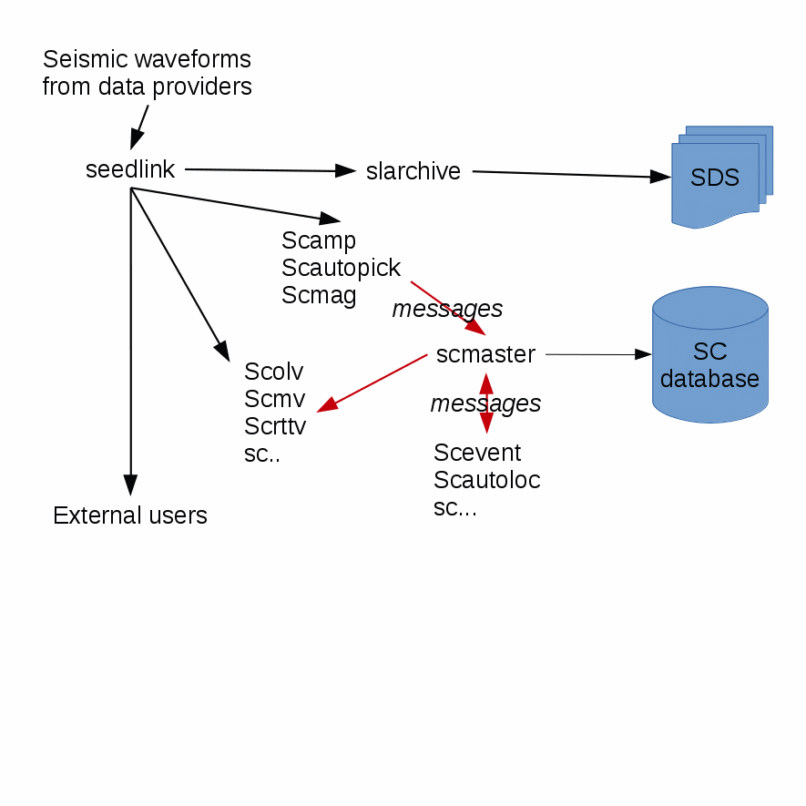
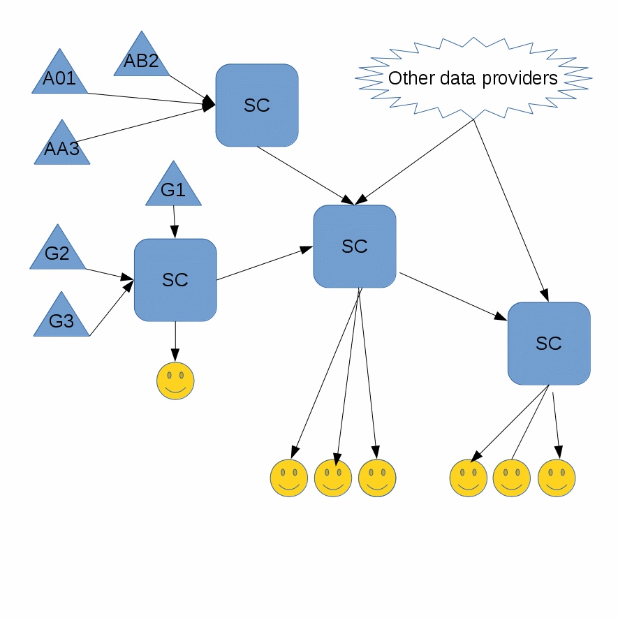

.. _overview:

********
Overview
********

*[Should this be renamed as "Getting Started"? Then the later "Getting started" could be renamed as "Setting Up"? Or should it be merged with the following section, :ref:`concepts`]*

*[This section was very loosely derived from GEOFON Training Material by the GEOFON Team ca. 2016-2018]* ???

Modular structure
=================

A SeisComP system involves several modules working together to process data.
Each has a particular task, such as:

* Acquisition of waveform data from one or more providers

* Waveform archiving

* Processing to identify picks

* Processing to detect events and compute locations

* Providing a user interface for manually reviewing events

and so on.

   Modular organisation of SeisComP.

As modules run, they produce objects corresponding to geophysical concepts
such as picks and origins.
These objects are exchanged with, and stored for later use by, other modules.
Communication between these modules happens in two ways:

#. Via objects stored in, and retreived from, a shared database.
#. Via messages exchanged between modules.

Managing this communication in SeisComP is the job of the messaging
mediator :ref:`scmaster`.
This module acts as gatekeeper to the database, and only it is allowed
write access to the database.
Currently  :ref:`scmaster` uses the open source
`Spread <http://www.spread.org>`_ messaging toolkit
which provides a high performance messaging service.
Additional details are found under :ref:`concepts_messaging` in the :ref:`concepts` chapter.

SeisComP modules can access waveform data from many difference sources,
such as a Seedlink server or an FDSN web service.
These need not be on the same computer as the module.
In SeisComP terminology, these source are *record streams*
(see :ref:`concepts_recordstream`).

Taken together, this design gives SeisComP operators much flexibility.
Since messages can be exchanged between different computers, and
waveform data can be obtained from many sources, the different modules
do not all have to be on a single computer.
Multiple operators can connect to a single SeisComP installation from their own computers.

Data formats and sources
========================

In SeisComP, most waveform data is currently handled as Data Only
:term:`SEED` records.
A time series of records is identified by its stream identifier,
following the SEED naming convention, ::

  NET.STA.LOC.CHA

where::

  NET - two or three letter alphanumeric network code
  STA - 1-5 letter alphanumeric station code
  LOC - 0 or 2-letter alphanumeric location code

Here *alphanumeric* means the digits 0 to 9, and uppercase letters A-Z.

For publically-available seismic stations these are generally supplied
from an external Seedlink server.
For example, the GEOFON seismic network makes data available at port 18000
at geofon.gfz-potsdam.de.

If you operate your own seismic network, you may collect data directly
from your station's digitizer using one of the many plugins included with
the :ref:`seedlink` module.
You can configure SeisComP to obtain data for each station via bindings.
This is described in (:ref:`seedlink`??) TBD.

This data can be saved locally, using SeisComP's :ref:`slarchive` module.
These are organised in a structured way on your local file system,
with one file for each channel and day, known as the :term:`SDS` archive.
Thanks to SeisComP's :ref:`concepts_recordstream` concept, its modules
can be reconfigured to use the local data, allowing *playbacks*.
This ability to replay old waveforms and re-analyse them, is very
important for exploring your system configuration, and developing
SeisComP.

Finally, being both a collector and a server of waveform data,
Seedlink allows you to chain SeisComP installations together to
obtain waveform data from upstream sources and relay it to other data users.

   Data flows from stations (triangles) to data centers to analysts.

Processing at each site is done by setting
an appropriate RecordStream :ref:`concepts_recordstream`.

Metadata formats and sources
============================

By "Inventory" we mean all information about seismic streams and stations
that is needed for processing the raw data obtained from sensors.
This is also referred to as seismic *metadata*.
It includes

* Channel names and time periods (epochs)
* Sample rates
* Instrument responses
* Station locations

and other essential information.
Today there are three common formats to store metadata:

* FDSN StationXML
* SeisComP inventory
* Dataless SEED - the old *de facto* standard.

Dataless SEED can be imported to, and exported from, SeisComP if needed.

You can get it from the same source as you obtain your seismic data itself.

Except for "native" SeisComP inventory, inventory needs to be imported
into SeisComP, and loaded into its database, before data can be processed.
There are various tools to do this.
They are described in the :ref:`modules_inventory` section of this manual.

What next?
==========

The following sections of this manual will help you install SeisComP
(Section :ref:`installation`).
You will then need to obtain some inventory and a source of waveform data.
Configure bindings, enable the processing modules, and restart SeisComP.
If all has gone well, you should see some stations as colorful triangles in
:ref:`scmv`,
and their traces in
:ref:`scrttv`.

Eventually, your new SeisComP system will pick and create origins,
should a locatable :term:`seismic event <event>` take place while it
is running.

Where to go for more help
=========================

Note that most of the SeisComP modules have built-in help messages.
As described in :ref:`concepts_configuration`, most commands can be called with the ``--help`` option at the command line.
This help information is also available as Unix manual pages by
building the appropriate files in the documentation directory.
To use it, you can either add the appropriate directory to your ``MANPATH`` environment variable, or view the manual pages directly

.. code-block:: sh

   # If the documentation is installed in your SeisComP directory,
   # otherwise change to the location of the man1 directory.
   export MANPATH=$MANPATH:$HOME/seiscomp/man
   man scevent  # Or any other SeisComP command.

or

.. code-block:: sh

   nroff -man /path/to/man1/scevent.1 | less  # Replace /path/to for your system

The :ref:`scconfig` GUI tool displays help on each individual
configuration file option, under "Modules", and then the command of interest.
For each configuration parameter, hover over the short help text
beneath the box for that parameter, in order to see a pop-up with the
its long help text.

There are other sources of information beyond this documentation.
The SeisComP forum at
`http://forum.seiscomp.org/ <http://forum.seiscomp.org/>`_
has many useful contributions from the community.
You are encouraged to register and post your own questions and comments there.
Additional support by GFZ is NOT provided.
However, you can also request professional support
(installation, training courses, maintenance, module development and modification)
from `gempa GmbH <http://www.gempa.de/>`_, a software company out-sourced from GFZ
and founded by the main SeisComP developers.

Good luck!
