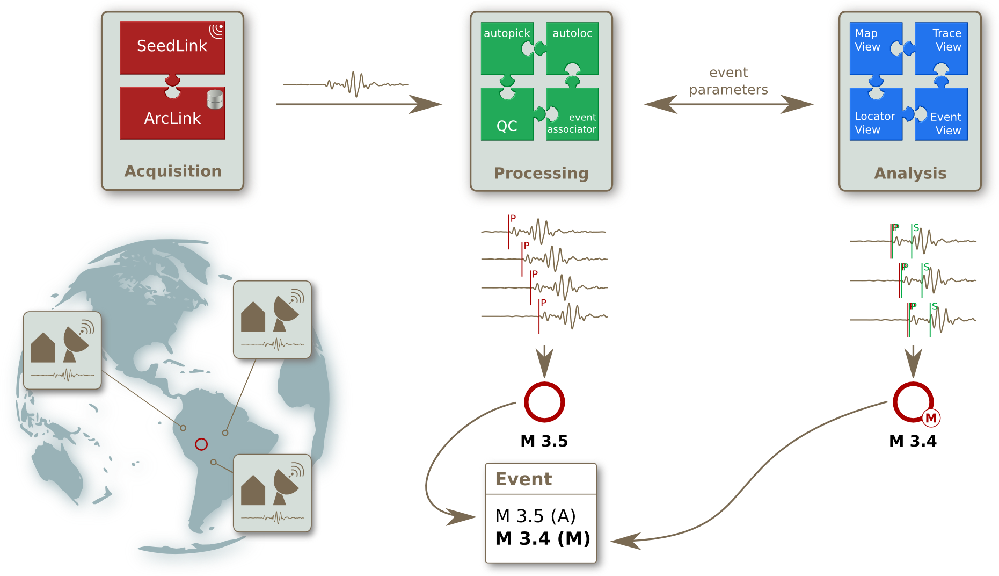
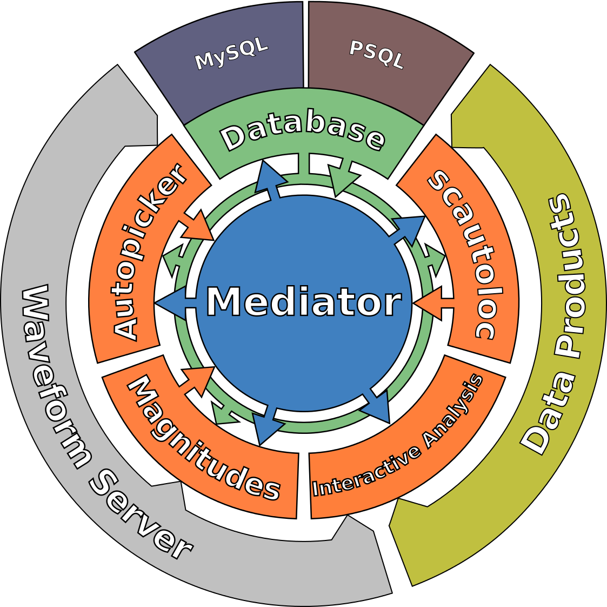
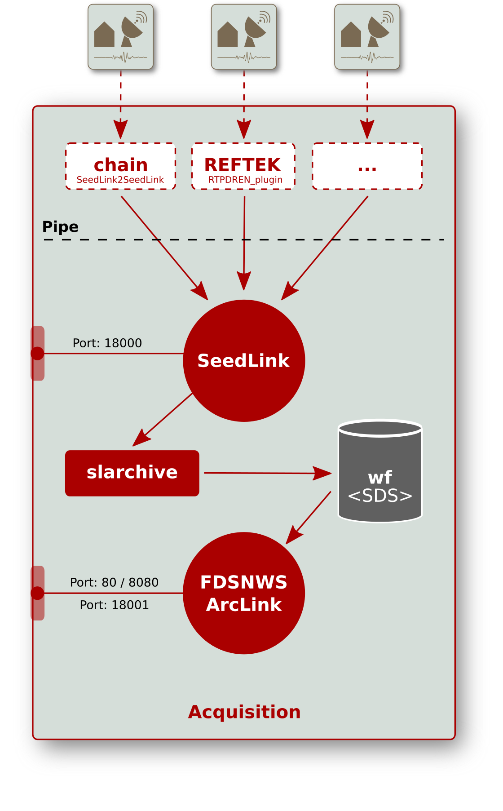
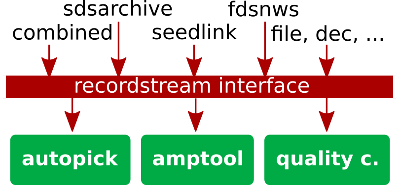

.. _overview:

********
Overview
********

This overview section is intended to quickly introduce the reader into
key aspect of |scname| and to provide the access points for further reading.

Modular structure
=================

A |scname| system is not a single piece of software but it involves automatic and
interactive modules working
separately to process data and to analyze seismicity.
Read the :ref:`concepts section on modules <concepts_modules>` for more conceptional details.

Each module has a particular task, such as:

* Acquisition of waveform data from one or more providers
* Waveform archiving
* Waveform processing to identify phase arrivals
* Processing of phase picks to detect events and compute locations
* Providing a user interface for manually reviewing events

and many more. Key features are summarized in the :ref:`introduction <introduction>`.

   Real-time data acquisition, archiving and automatic processing combined with manual analysis.

Data acquisition modules
------------------------

Data acquisition modules allow to provide and store waveform data in real-time.
They are described in the acquisition section of the modules documentation.

Automatic processing modules
----------------------------

Automatic processing modules allow real-time or offline processing of waveforms and event parameters.
They are described in the processing section of the modules documentation.

Interactive modules
-------------------

Interactive :term:`GUI` modules show waveforms and processing results and allow user interactions:

* :ref:`scolv`: processing waveforms, locating events and determining magnitudes and focal mechnisms
* :ref:`scrttv`: view waveforms and phase picks, select events for processing in scolv, enable or disable stations
   for automatic processing
* :ref:`scmv`: view station locations on a map with status information and waveforms, select events for processing in scolv
* :ref:`scesv`: view the latest events on a map and relevant event parameters
* :ref:`scheli`: view the seismogram of a station in a helicorder plot, save images automatically
* :ref:`scqcv`: view waveform quality control (QC) parameters, enable or disable stations
   for automatic processing
* :ref:`scmm`: the messaging system monitor

The GUI modules are described in the Interactive analysis section of this documentation.

Inventory modules
-----------------

Inventory modules allow to manipulate inventories, e.g. to convert different formats
or to write information to the database.
They are described in the inventory section of the modules documentation.

Utility modules
---------------

Utility modules provide access to waveforms, the data base and much more.
They are described in the utilities section of the modules documentation.

Communication and database access
=================================

As modules run, they produce objects corresponding to geophysical concepts
such as :term:`picks <pick>` and :term:`origins <origin>`.
These objects are exchanged with, and stored for later use by, other modules.
Communication between these modules happens in two ways:

#. Via objects stored in, and retrieved from, a shared database.
#. Via messages exchanged between modules.

Managing the communication between the modules in |scname| is the job of the :ref:`messaging
system <concepts_messaging>`.
The messaging system is controlled by :ref:`scmaster`. It acts as gatekeeper to the database,
and only the module :ref:`scmaster` is allowed
write access to the database.
Additional details are found under :ref:`concepts_messaging` in the :ref:`concepts` chapter.

   Modular organization of |scname| with messaging system, RecordStream interface and database.

Waveform data
=============

Internally in |scname|. most waveform data is currently handled as :term:`miniSEED` data (Data Only
:term:`SEED` records).
A time series of records is identified by its stream identifier,
following the SEED naming convention, ::

  NET.STA.LOC.CHA

where::

  NET - two or three letter alphanumeric network code
  STA - 1-5 letter alphanumeric station code
  LOC - 0 or 2-letter alphanumeric location code
  CHA - 3-letter channel or stream code

Here *alphanumeric* means the digits 0 to 9, and uppercase letters A-Z.

For publicly-available seismic stations these are typically supplied
by external servers such as :ref:`seedlink` or :cite:t:`caps` servers.
For example, the :cite:t:`geofon` seismic network makes data available at port 18000
at geofon.gfz-potsdam.de which you may query and test using :ref:`slinktool`.

If you operate your own seismic network, you may collect data directly
from your station's digitizer using one of the many plugins included with
the :ref:`seedlink` module.
You can configure |scname| to obtain data for each station via :term:`bindings <binding>`.
This configuration is described in the :ref:`tutorial on seedlink <tutorials_geofon_waveforms>`.

Waveform data can be saved locally, using |scname|'s :ref:`slarchive` module.
The waveform archive is organized in a structured way on your local file system,
with one file for each channel and day, known as the :term:`SDS` archive.
Thanks to |scname|'s :ref:`concepts_recordstream` concept, its modules
can be reconfigured to use the local data from an archive, a server or from files, allowing *playbacks*.
This ability to replay old waveforms and re-analyze them, is very
important for exploring your system configuration, and developing
|scname|.

Finally, being both a collector and a server of waveform data,
:ref:`seedlink` allows you to chain |scname| installations together to
obtain waveform data from upstream sources and relay it to other data users.

   Data flow from data centers and stations via plugins to seedlink and the waveform archive
   both providing the data to local or remote |scname| modules or other clients.

   
Access to Waveform Data
=======================

|scname| modules can access waveform data from many difference sources,
such as a Seedlink server or an FDSN web service.

In |scname| terminology, the data from these sources are *record streams*.
Access to the waveform data can be configured by setting an appropriate :term:`RecordStream`.
Read the :ref:`concept description of the RecordStream<concepts_recordstream>`
and :ref:`technical documentation of the various implementations <global_recordstream>` for many more details.

   The RecordStream interface provides flexible access to waveform data.

Taken together, this design gives |scname| operators much flexibility.
Since messages can be exchanged between different computers, and
waveform data can be obtained from many sources, the different modules
do not all have to be on a single computer.
Multiple operators can connect to a single |scname| installation from their own computers.

Station metadata
================

By :term:`inventory` we mean all information about seismic streams and stations
that is needed for processing the raw data obtained from sensors.
They are therefore also referred to as *station metadata*.
Read the :ref:`concepts section on inventory <concepts_inventory>` for more details
on formats and configuration in |scname|.

Inventories include

* Names and time periods of networks, stations, locations and streams (epochs)
* Sample rates
* Instrument responses (sensor and data logger)
* Station and sensor coordinates

and other essential information.
Today there are some common formats to store metadata:

* FDSN StationXML
* |scname| inventory
* Dataless SEED - the old *de facto* standard
* ArcLink XML.

Dataless SEED can be imported to, and exported from, |scname| if needed.

You can get inventory information from various public sources including
:cite:t:`eida` or :cite:t:`iris` and many more. :cite:t:`smp` allows you to
create and share meta data from your own
station network and to export an inventory in :term:`SCML` format.

Inventories for all considered recording stations need to be imported
into |scname|. and loaded into its database, before data can be processed.
There are various tools to do this.
The tools are described in the inventory section of this documentation.

.. note ::

   In order to process data streams, the inventory must provide complete response information
   for all the streams AND must match the :term:`bindings <binding>` configuration.

Configuration
=============

The basics of configuring a |scname| system are described in the
:ref:`concepts section <concepts_configuration>`. The :ref:`tutorials` of this
documentation provide step-by-step recipes. The modules documentation explains
the modules functioning, their configuration and command-line parameters and
give additional examples and links to related topics.

What next?
==========

The following :ref:`installation` section of this manual will help you install |scname|.
You will then need to obtain some inventory and a source of waveform data.
Configure bindings, enable the processing modules, and restart |scname|.
If all has gone well, you should see some stations as colorful triangles in
:ref:`scmv`,
and their traces in
:ref:`scrttv`.

Eventually, your new |scname| system will pick and create origins,
should a locatable :term:`seismic event <event>` take place while it
is running.

Where to Go for More Help
=========================

The :ref:`tutorial on help<tutorials_help>` provides comprehensive list of options
to get help on |scname|.
Most |scname| modules have built-in help messages and descriptive HTML
documentation. Read the :ref:`tutorial on help <tutorials_help>` for a neat
introduction.

There are other sources of information beyond this documentation. The
:cite:t:`seiscomp-forum` has many useful contributions from the community.
You are encouraged to register and post your own questions and comments there.

Professional support including installation, training courses, maintenance,
module development and modification is provided world-wide by
`gempa GmbH <https://www.gempa.de/>`_ :cite:p:`gempa`, a
software company out-sourced from GFZ and founded by the main |scname|
developers.

Enjoy |scname|!
