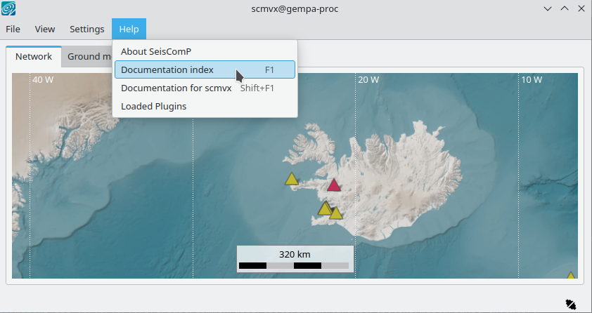
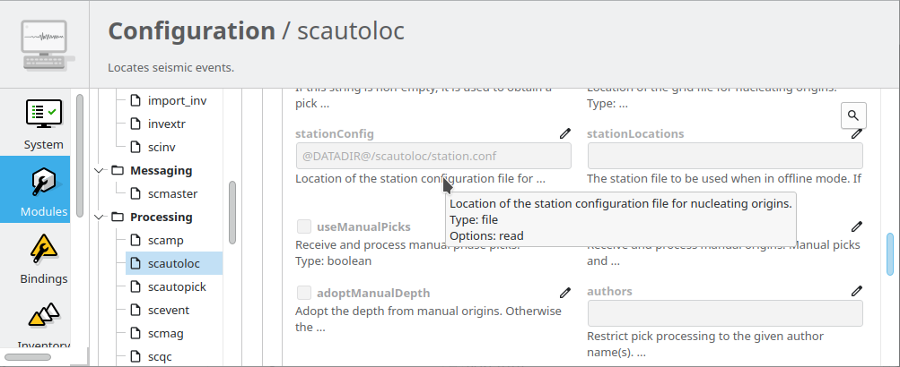
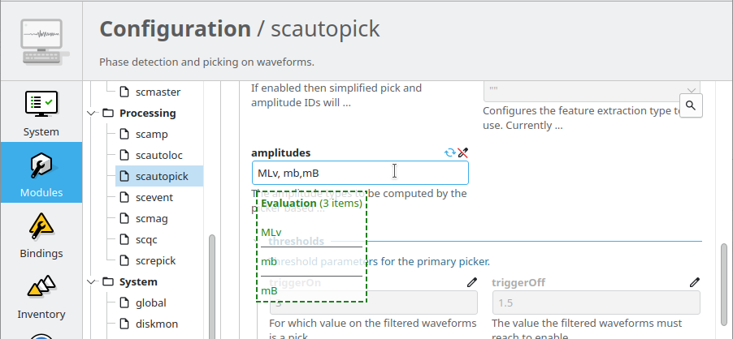
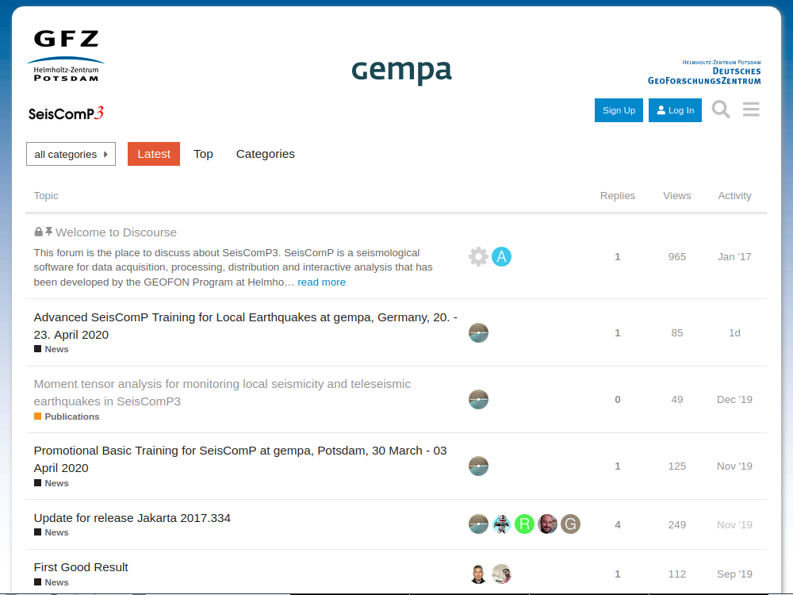

.. _tutorials_help:

**************************
Help! I'm stuck! Now what?
**************************

You will ...

* Troubleshoot and resolve problems with SeisComP

Pre-requisites for this tutorial:

* Have your SeisComP installation and configuration available

Afterwards/Results/Outcomes:

* Improved understanding of ways to solve issues when operating SeisComP

Time range estimate:

* 30 minutes

----------

Outline
=======

Inevitably you will encounter difficulties using SeisComP.
This tutorial reviews a few ways to diagnose your problems and
get help to resolve them:

* Detailed :ref:`HTML documentation <sec_tutorial_help_documentation>`
* :ref:`Commandline help <sec_tutorial_help_commandline>`
* The :ref:`SeisComP Forum <sec_tutorial_help_forum>`
* Reviewing :ref:`logging options <sec_tutorial_help_logging>`
* The :ref:`debugging options <sec_tutorial_help_debugging>`
* :ref:`Commercial support <sec_tutorial_help_commercial>`

Ways to diagnose and to get help
================================

.. _sec_tutorial_help_documentation:

HTML documentation
------------------

Most modules have HTML documentation. When installed, it can be found in :ref:`scconfig`
under *Docs*. The HTML documentation can also be reached from the *Help*  menu of all GUIs.
It contains the description of configuration and command-line parameters along with
an overview with many detailed information.

   :ref:`scmv` with access to the HTML documentation.

The description of most configuration parameters is also available from
within :ref:`scconfig`.
Look under *Modules*, and choose the relevant module.
For each parameter, the first few lines of description are shown;
hovering over these reveals the full text.

The HTML documentation is built regularly and available online, e.g.
`gempa's documentation <https://docs.gempa.de>`_.

.. _sec_tutorial_help_commandline:

Commandline help
----------------

In addition to the HTML documentation, many SeisComP commands have manual
pages which can be read on the command line:

.. code-block:: sh

   $ man [module name]

and help on command-line options:

.. code-block:: sh

   $ [module name] -h

.. note::

   The command-line option *-h* can be used with almost all modules. No matter how many
   other command-line parameters were given, *-h* will stop the module and print
   the help on the command-line.

.. _sec_tutorial_help_config-params:

Configuration parameters
------------------------

The :ref:`scconfig` GUI tool can be conveniently used to adjust the :term:`module`
and :term:`bindings <binding>` configuration. It also displays help on each individual
configuration parameter for every module. Read the :ref:`concepts
section on configuration <concepts_configuration>` for a comprehensive overview.

.. raw:: html

  

  Tool tips provide information on parameters.

  scconfig evaluates the syntax of input values.

.. raw:: html

  

.. _sec_tutorial_help_cmdline-params:

Command-line parameters
-----------------------

Command-line parameters provide additional flexibility when executing modules.
To learn about them read the :ref:`sec_tutorial_help_documentation` or execute

.. code-block:: sh

   $ [module name] -h

.. _sec_tutorial_help_forum:

The SeisComP Forum
------------------

   The :cite:t:`seiscomp-forum`.

The :cite:t:`seiscomp-forum` is the place to discuss |scname|.
Announcements about updates, training courses and more are posted
here by the developers, and users can post questions or discuss
new developments.
Anyone can browse the forum, while registration is required to post there.

If you have specific technical problems, it helps to have tried
some of the ideas below.
Please include version information (the '-V' option described below)
if you report a problem.

.. _sec_tutorial_help_logging:

Logging
-------

Most SeisComP applications use a standard logging approach.
By default, they log to files in your :file:`~/.seiscomp/log` directory,
such as :file:`scamp.log`.
Further options for logging are described in
:ref:`concepts_configuration`.

You can control how often these are rotated
(old log files are closed, and moved to a new file name, such as scamp.log.1, e.g. daily).
Alternatively you can use the system-wide logging facility `syslog`
and send logs to /var/log or another "standard" place.

There are four levels of severity of SeisComP log messages,
and applications can be configured to show only those which
are more severe than a given threshold.

* 1 = ERROR
* 2 = WARNING
* 3 = INFO
* 4 = DEBUG.

Default is 2.
Setting `logging.level = 4` results in the most messages.

For other modules such as :ref:`seedlink`, the log files are written to
:file:`seiscomp/var/log/`

.. _sec_tutorial_help_debugging:

Debugging options
-----------------

Most SeisComP applications support two important command line options:

* Use `--console` to send output to the terminal instead of the usual
  log location.

* `-v` for increased verbosity, or use `--verbosity=` *n* where *n*
  is one of the four severity levels above.

In addition:

* `--debug` sets logging.level (see above) to 4 (DEBUG),
  and sends logging output to the console (terminal) instead of the usual
  log location.
  (This is just an easier way of specifying `--verbosity=4 --console=1`.)
  For example:

  .. code-block:: sh

     $ ~/seiscomp/bin/seiscomp exec scmag --debug
     11:47:50 [debug] Adding plugin path: .
     11:47:50 [debug] Adding plugin path: /home/user/.seiscomp/plugins
     11:47:50 [debug] Adding plugin path: /home/user/seiscomp/lib/plugins
     11:47:50 [debug] Adding plugin path: /home/user/seiscomp/lib
     11:47:50 [debug] Adding plugin path: /home/user/seiscomp/share/plugins
     11:47:50 [debug] Adding plugin path: /home/user/seiscomp/lib
     11:47:50 [debug] Adding plugin path: /home/user/seiscomp/lib
     11:47:50 [debug] Adding plugin path: /home/user/seiscomp/share/plugins/scmag
     11:47:50 [debug] Trying to open plugin at /home/user/seiscomp/share/plugins/dbmysql.so
     11:47:50 [info] Plugin dbmysql registered
     11:47:50 [info]
     Plugins:
     --------
      [1]
       description: MySQL database driver
            author: GFZ Potsdam <seiscomp-devel@gfz-potsdam.de>
           version: 0.9.2
               API: 12.1.0

     11:47:50 [info] Connect to messaging
     11:47:50 [debug] Trying to connect to scmag@localhost with primary group = MAGNITUDE
     11:47:50 [info] Connecting to server: localhost
     11:47:50 [info] Connected to message server: localhost
     11:47:50 [info] Joining MASTER_GROUP group
     11:47:50 [info] Sending connect message to server: localhost
     11:47:51 [info] Server version is 'Jakarta 2018.327.p15'
     11:47:51 [info] Outgoing messages are encoded to match schema version 0.11
     11:47:51 [info] user "scmag" connected successfully to localhost

  The above reveals that :program:`scmag` was able to load, and connect to the
  messaging system.
  Note that the *verbosity* of each message ("info", "debug", etc) is also
  shown.
  However a moment later we see:

  .. code-block:: sh

     11:47:51 [info] Connect to database
     11:47:51 [debug] skipping unknown network message
     11:47:51 [debug] skipping unknown network message
     11:47:51 [debug] skipping unknown network message
     11:47:56 [error] Timeout while waiting for database provide message
     11:47:56 [debug] Leaving ::done
     11:47:56 [info] Shutting down MagTool
     - database accesses while runtime: 0

  This suggests that :ref:`scmaster` was not running to provide a
  connection to the database.
  To resolve this, you could next check that :ref:`scmaster` is
  running as expected.

.. note::

   Instead of `--debug` in the example above, you could run

   .. code-block:: sh

      $ ~/seiscomp/bin/seiscomp exec scmag -vvvv

   The output is the same, but it is sent to your normal logging file,
   typically `~/.seiscomp/log/scmag.log`.

In :ref:`scconfig`, logging can be set globally.
Go to the Modules tab, then System > global (see "logging")
or per module.

e.g. set "logging.level = 3" in $SEISCOMP_ROOT/etc/scamp.log
to set level to *INFO* only for :ref:`scamp`.

You should also be aware of the version of SeisComP that you are running.
The '-V' or '--version' option provides this for many SeisComP modules.

.. code-block:: sh

   $ ~/seiscomp3/bin/seiscomp exec scmag -V
   scmag: Jakarta 2018.327.p15
   API version: 12.1.0
   GIT HEAD:
   Compiler: c++ (Ubuntu 7.3.0-16ubuntu3) 7.3.0
   Build system: Linux 4.15.0-20-generic
   OS: Ubuntu 18.04 LTS / Linux

.. _sec_tutorial_help_commercial:

Commercial support
------------------

Professional commercial support to SeisComP users is available from
:cite:t:`gempa`.

Next time you have a problem
============================

* Try some of the above techniques.
* If you find a solution, don't forget to share it at the :cite:t:`seiscomp-forum`.
