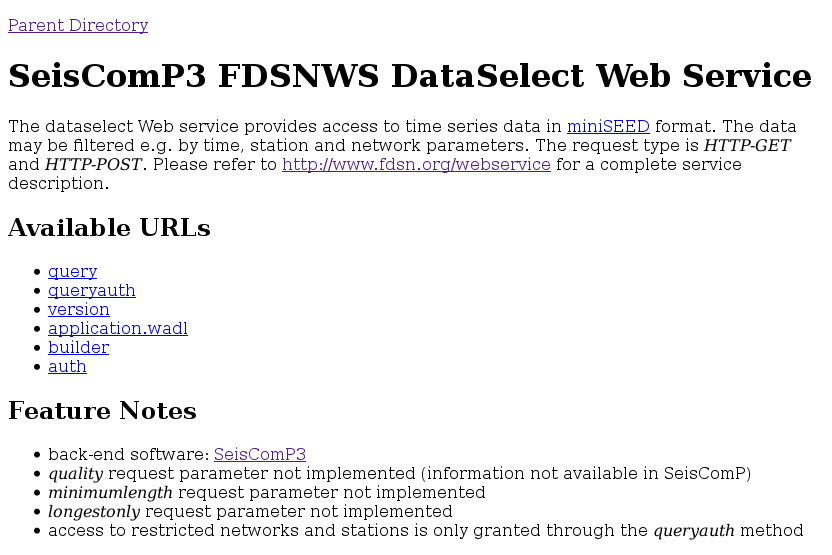
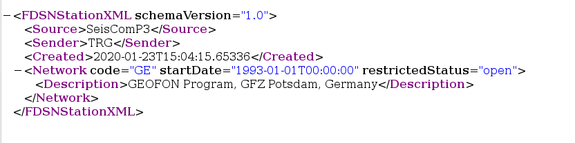

.. _tutorials_servefdsnws:

**************************
Enable local FDSNWS server
**************************

You will ...

* Enable FDSN web service [#FDSN_SPEC]_ to serve waveforms and inventory for
  a configured station

Pre-requisites for this tutorial:

* Tutorial on :ref:`tutorials_archiving`

Afterwards/Results/Outcomes:

* The station meta data and waveforms are available from a local web server

Time range estimate:

* 10 minutes

----------

By default, :ref:`fdsnws` will serve the three FDSN web services

* fdsnws-dataselect
* fdsnws-event
* fdsnws-station

on a server running locally on port 8080.

The additional *availability* feature allows users to obtain information
on continuous data segments in the waveform archive.
This information is written to the
:ref:`database <concepts_database>` by :ref:`scardac`.
To active the availability feature set :confval:`serveAvailability` and
:confval:`dataAvailability.enable` to true.
The availability information can be retrieved using :ref:`scxmldump` or :ref:`fdsnws`.

Set-up
======

#. Configure :program:`fdsnws`:

   * set the :ref:`RecordStream <concepts_RecordStream>` to point to archived data.
   * configured and enable the desired services.

#. Enable and start fdsnws locally:

   * in :program:`scconfig`, go to the System tab.
     Click on the line for the "fdsnws" module, and press "Enable module(s)".
     Then restart SeisComP.

   * or from the command line ::

     $ seiscomp enable fdsnws
     $ seiscomp start fdsnws

#. Test by :ref:`visiting the locally started fdsnws <tutorials_servefdsnws-visit>`.

Logging information goes to :file:`~/.seiscomp/log/fdsnws.log` by default.
Information about requests handled goes to the file named in `accessLog`,
if you set this.

To see the available configuration options, go to the Modules tab in
:program:`scconfig`.
Under Utilities open "fdsnws" to reveal the options.
To disable fdsnws-event, for instance, unlock the "serveEvent" area
and uncheck this parameter.

You can limit the choice of stations shared to be less than what is in your
SeisComP :ref:`inventory <concepts_inventory>` using the `allowRestricted`,
`dataSelectFilter` and `stationFilter` options.

.. _tutorials_servefdsnws-visit:

Visiting the service
====================

Once :program:`fdsnws` is running, you can visit the local web server
that it runs.
In your browser, visit http://localhost:8080/fdsnws/dataselect/1/

   Information screen shown by fdsnws-dataselect at
   http://localhost:8080/fdsnws/dataselect/1/

Check it works
==============

* If you visit the URL http://localhost:8080/fdsnws/dataselect/1/version
  you should receive a version number string - currently `1.1.0`.

* To view all activated services visit http://localhost:8080/fdsnws/

* The fdsnws-station service should give a list of networks configured
  and served by the service, e.g. visiting
  http://localhost:8080/fdsnws/station/1/query?level=network&format=text
  produces::

    #Network|Description|StartTime|EndTime|TotalStations
    GE|GEOFON Program, GFZ Potsdam, Germany|1993-01-01T00:00:00||84

  Omitting the `format=text` argument in the query string of the above URL
  results in the service returning a StationXML file.

   Example of StationXML returned by the fdsnws-station service at

   http://localhost:8080/fdsnws/station/1/query?level=network

Further information
===================

* The `URL Builder at GEOFON`_
  lets you fill out a form to tailor your request.
  The URL to use to make your request is displayed at the bottom of that page.

* More example requests are at the `FDSNWS description at GEOFON`_

* The FDSN Web Services specification document [#FDSN_SPEC]_ provides the
  technical documentation and examples.

Final tests
===========

* The station should now be visible when you query your local fdsnws instance.
  In your browser, visit
  http://localhost:8080/fdsnws/station/1/query?format=text
  to see a list of all channels available from your fdsnws server.

* Request waveform data like this:

  http://localhost:8080/fdsnws/dataselect/1/query?start=2020-01-01T01:01:01&end=2020-01-01T02:00:00

  Don't forget to adjust your start and end times to match the data
  actually present in your archive.
  The above example is just for the first hour of 2020.

References
==========

.. target-notes::

.. [#FDSN_SPEC] International Federation of Digital Seismograph Networks (2019-04-02).
        FDSN Web Service Specifications Version 1.2.
        At http://www.fdsn.org/webservices/FDSN-WS-Specifications-1.2.pdf

.. _`URL builder at GEOFON` : https://geofon.gfz-potsdam.de/waveform/builder.php
.. _`FDSNWS description at GEOFON` : https://geofon.gfz-potsdam.de/waveform/webservices.php
.. _`scripts for FDSNWS` : https://www.seiscomp3.org/doc/applications/fdsnws_scripts.html
